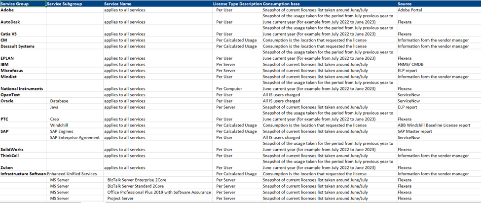
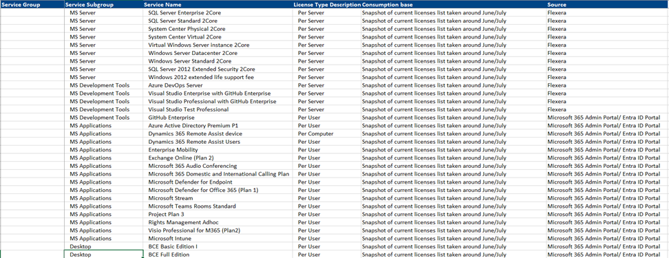

# IS Charges in Detail

## Central IS Charges

ABB Information Systems Ltd. is one of the [HQ company](https://go.insideplus.abb.com/corporate-functions/finance), recognized under the **CHGPL** code in **ABACUS**. The main activity of the entity is to provide Group IS services, projects, and operations.

### CHGPL Charge-Out Model

The CHGPL charge-out model consists of the following charge types:

- Direct Software Charges (DSC)
- User Based Charges (UBC)
- IS Users
- IT Services (ITS)
- Transformation Charges (TSI)
- Global Services Infrastructure (GSI)

---

## Direct Software Charges (DSC)

Reserved exclusively for:

- Global licensing models under CHGPL.
- Third-party software delivery managed under OCIO.

---

## User Based Charges (UBC)

### Reserved For

- Global platforms/services where end-user access is strictly controlled (i.e., a list of active user accounts can be provided by the Service Manager).
- Business-specific projects and applications addressing IS needs of a specific Business or Business Line within ABB.
- Other global platforms/services that should be charged proportionally based on underlying usage, where IS charges are directed to a specific Business or Function rather than distributed across the entire company.

---

## User License & Package (ULP)

### Includes

- Global IS governance and administration costs (e.g., central IS management and IS innovation).
- Global IS projects executed at the CHGPL level addressing ABB-wide IS needs (e.g., Brutal Facts).
- Cost of open global platforms/services where end-user access is not strictly controlled and services are generally available to all ABB users (e.g., ServiceNow, ABB.COM).
- The following platforms have been included under ULP since Q3 2021:
  - A3 Platform
  - Ability
  - Customer Experience
  - Human Resources
  - Service & Performance Excellence

---

## Cyber Security Charges (CSC)

Reserved exclusively for:

- Information Security activities and services under CHGPL.

---

### Additional Information

Charges are applied based on the approved charging model and software licensing allocation methodology defined by CHGPL.

---

## Global Services Infrastructure (GSI)

### Reserved For

Infrastructure services, including:

- Hosting Services
- Network Services
- EUX (End User Experience)
- EUS (End User Services)

# Security

Any unauthorized software installations will be detected through periodic compliance scans conducted every fortnight.

### Compliance Process

- An automated email notification will be sent to the respective user.
- The user must provide a valid justification for the installation and usage of the identified application/software on the company-owned asset.
- The response should clearly explain the business requirement and usage purpose.

### Non-Compliance

- Repeated detections of unauthorized software installations may result in further investigation.
- Continued non-compliance may attract additional actions in accordance with ABB policies and procedures.